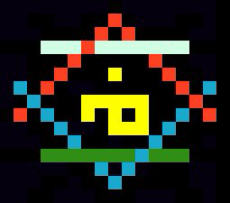

# vae + moi

Originally our team was called moi, which means "change" in \_The Ancient Language \_from Christopher Paolini's Inheritance Cycle series of novels, and we were located at moiinc.me. After talking to a mentor about pitches, monetizing and our "it" factor I realized I didn't envision moi as a company but more of a OSS community or team or super group. So we went back to the Ancient Language and found vae, meaning "we", and we knew we had struck gold, we did and **vaemoi** was born.

vaemoi want to make changes that take changes and make more changes to those aforementioned changes though the latter may be changed as a side effect that could cause a chain effect of ...and somewhere in all that you find some gold.

This book is a collection of ideas, opinions and methods to help make gold from your changes quickers. \(A living document\)

We are currently examining the following topics:

* ##### **Tracking Changes**
* ##### **Communicating Changes**
* ##### **Understanding Changes**
* ##### **Exposing Changes**

